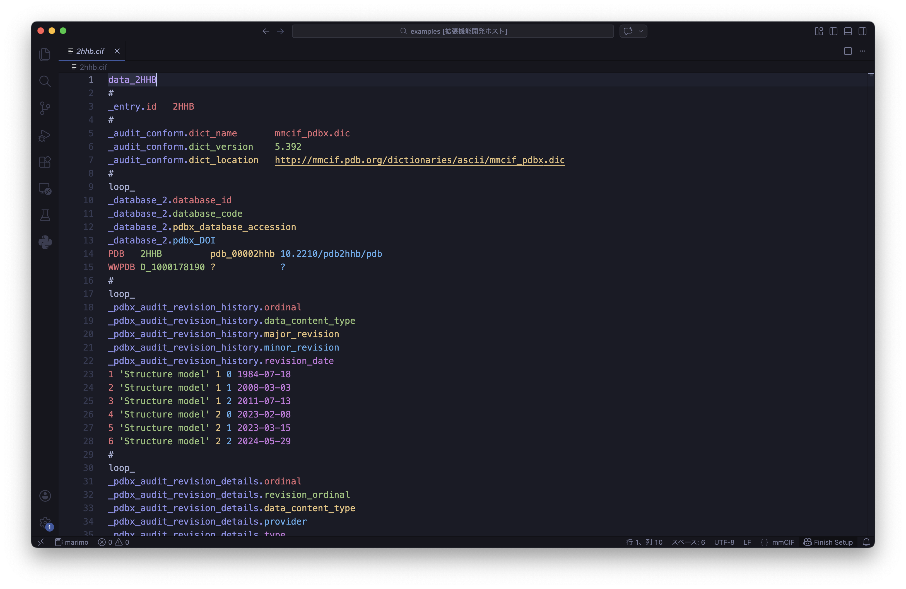
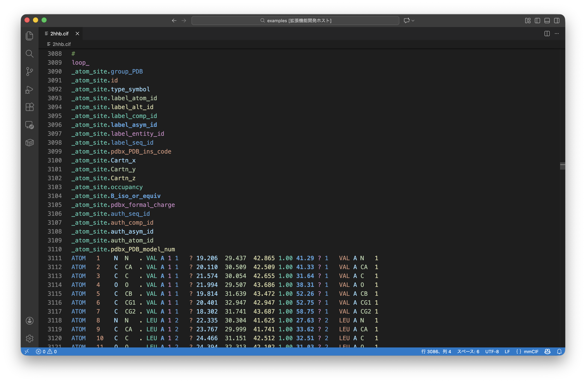
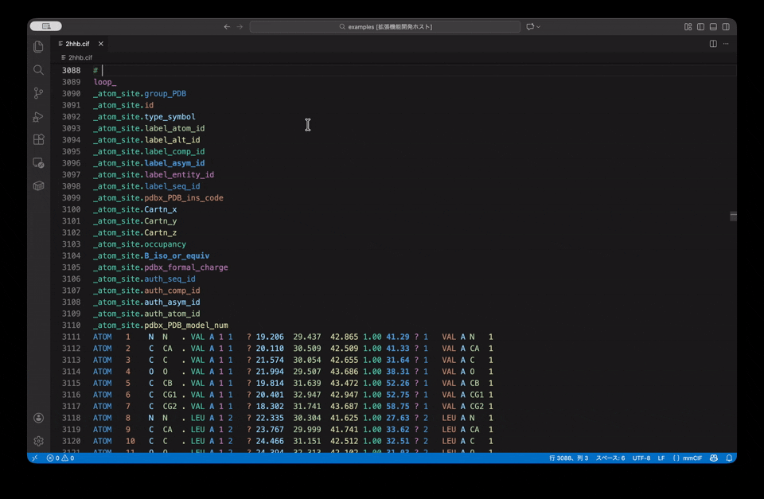
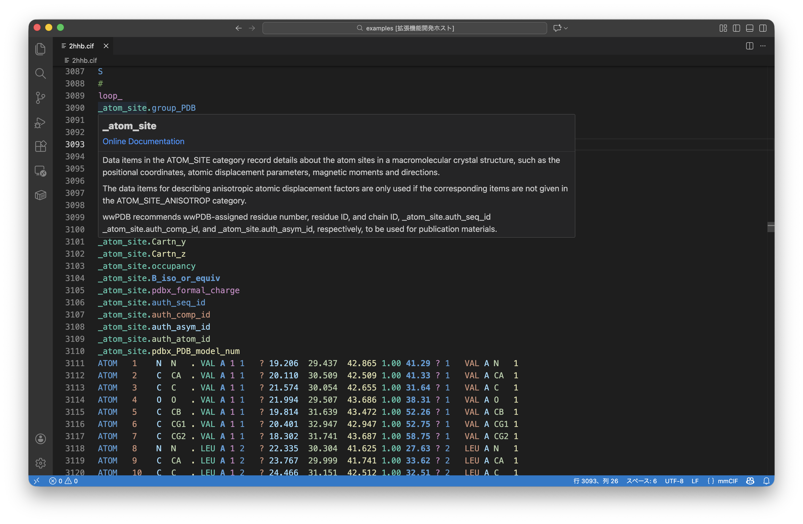
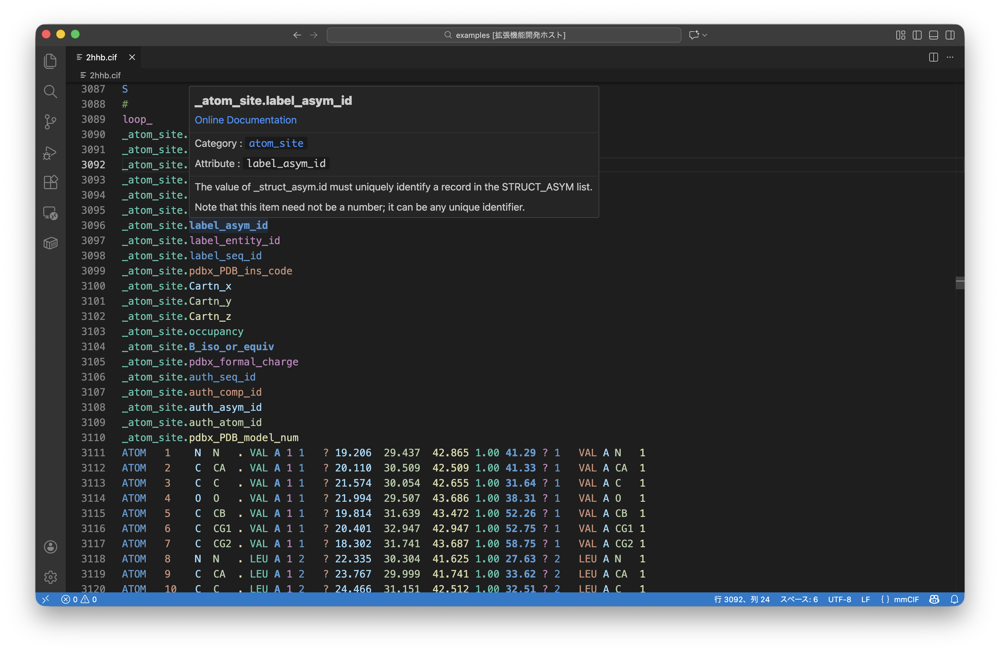
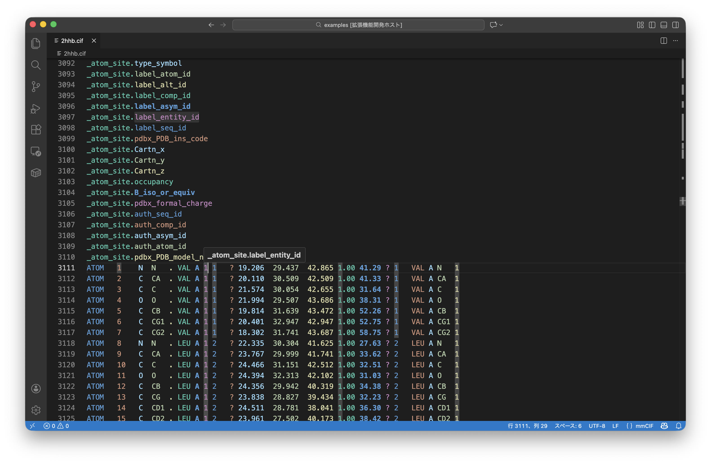
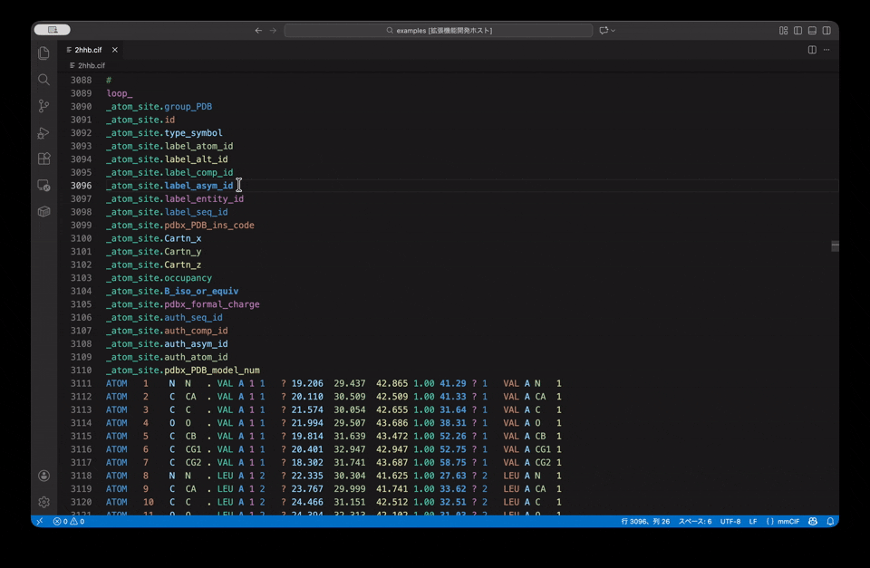
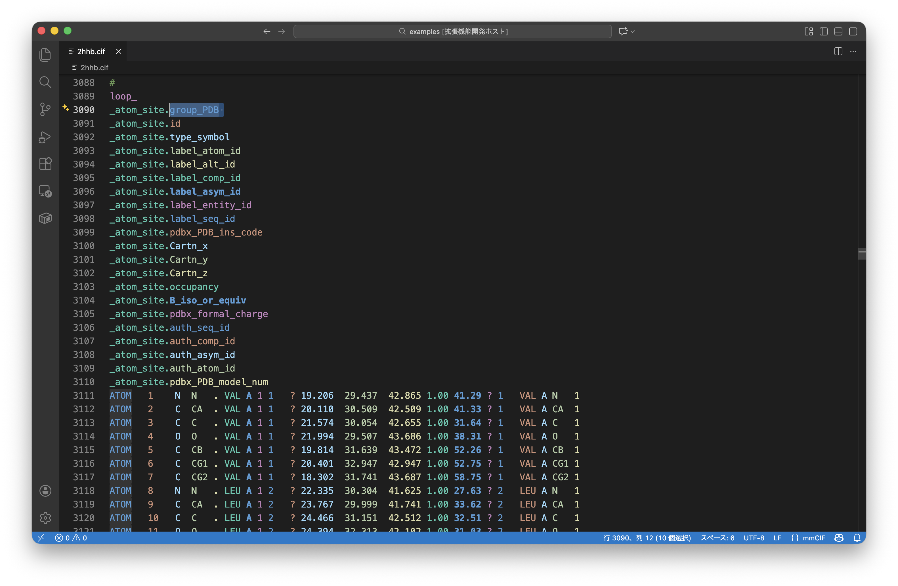
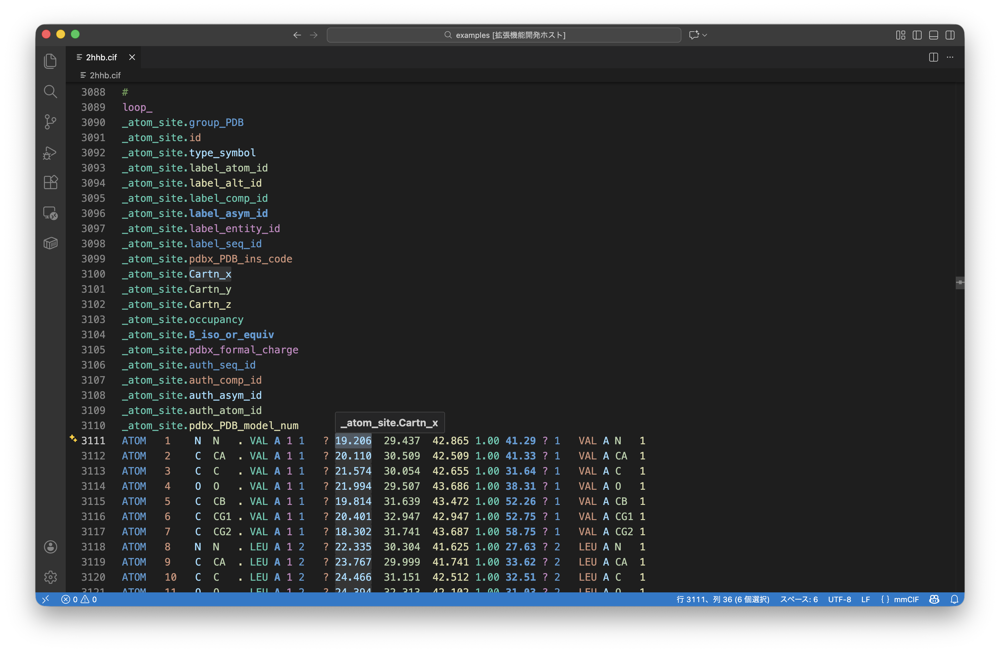

# Rainbow mmCIF (VS Code Extension)

[](https://marketplace.visualstudio.com/items?itemName=N283T.mmcif-rainbow)



This extension provides enhanced syntax highlighting and visual aids for **mmCIF** (Macromolecular Crystallographic Information File) files, widely used in structural biology. 

It is designed to make reading and editing complex mmCIF files effortless. Unlike standard syntax highlighters, this extension focuses on human-readable visualization of data blocks, inspired by [Rainbow CSV](https://github.com/mechatroner/vscode_rainbow_csv).

## Features

### 🌈 Rainbow Block Highlighting


All data items—whether in a `loop_` or a single-item section—are treated as a unified **Block**.
- **Category** (e.g., `_atom_site`) and **Item** (e.g., `.id`) are clearly distinguished.
- Columns are automatically colored using a cycling rainbow palette to help you quickly align keys with their values.



---

### ℹ️ Integrated Dictionary Hover



Gain instant access to the official PDBx/mmCIF dictionary metadata. Hover over any Category, Item, or data value to see its definition.
- **Context-Aware**: Dynamically displays documentation based on whether you hover over a **Category**, **Item**, or **Value**.
- **Direct Links**: Quick navigation to official wwPDB documentation for every tag.

#### Hover Format Examples

**For Category:**



```
### _category_name
[Online Documentation](...)

---
Category Description...
```

**For Item:**



```
### _category_name.item_name
[Online Documentation](...)

---
Category : category_name
Attribute : attribute_name

---
Item Description...
```

**For Value:**



```
### _category_name.item_name
```

---

### 🔦 Interactive Highlighting



Highlight an entire column by placing your cursor on any part of it. This tracking makes it impossible to lose your place in dense data tables.





---

## Installation

1. **[Install from VS Code Marketplace](https://marketplace.visualstudio.com/items?itemName=N283T.mmcif-rainbow)**
2. Open any `.cif` or `.mmcif` file. Highlighting and hover features will activate automatically.
3. Or build from source:
   ```bash
   npm install
   npm run compile
   ```

## Limitations

- **File Size Limit**: Due to VS Code's internal API limitations, extensions cannot access the content of files larger than approximately **50MB**. For these massive files, rainbow coloring and hover features will be disabled.

## Future Roadmap

- [ ] **Massive File Viewer**: We are exploring a dedicated Custom Document Viewer to handle massive mmCIF files (>50MB).

## Contributing

Issues and Pull Requests are welcome!
