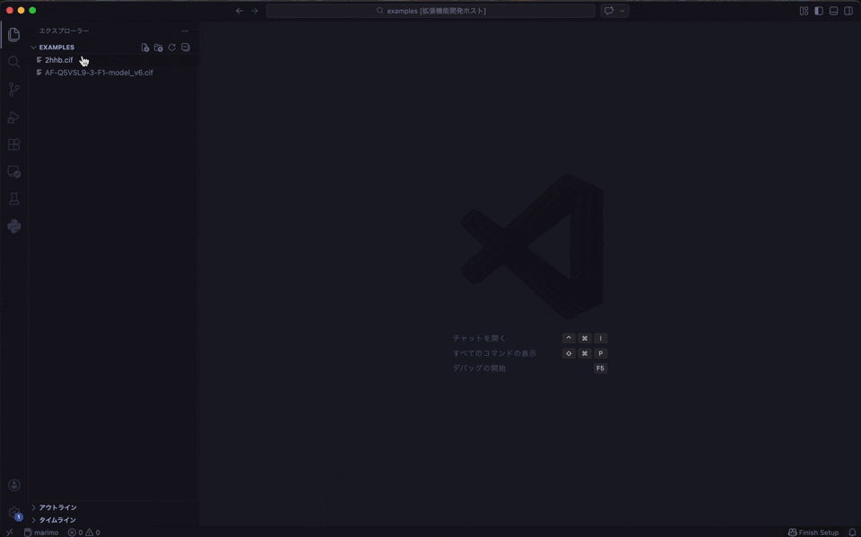
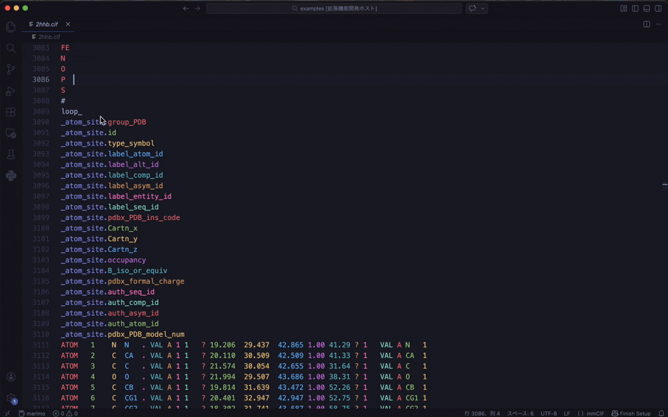
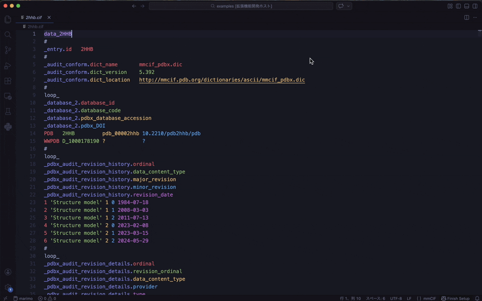
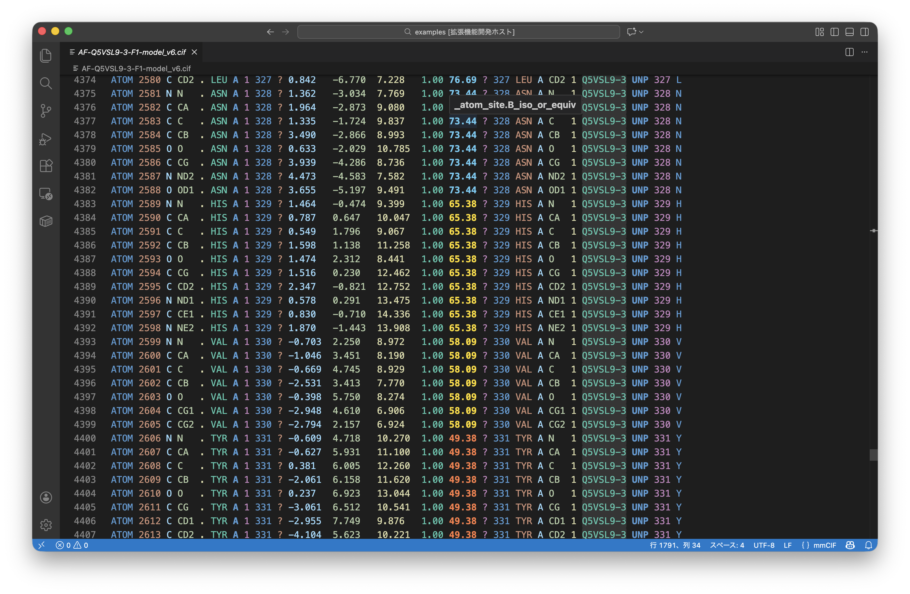

# Rainbow mmCIF (VS Code Extension)

[](https://marketplace.visualstudio.com/items?itemName=N283T.mmcif-rainbow)
[](https://github.com/N283T/mmcif-rainbow-vscode/actions/workflows/build.yml)


Enhanced syntax highlighting and visual aids for **mmCIF** (Macromolecular Crystallographic Information File) files, widely used in structural biology.

Designed to make reading and editing complex mmCIF files effortless. Unlike standard syntax highlighters, this extension focuses on human-readable visualization of data blocks, inspired by [Rainbow CSV](https://github.com/mechatroner/vscode_rainbow_csv).

## Features

### Rainbow Block Highlighting



All data items — whether in a `loop_` or a single-item section — are treated as a unified **Block**.

- **Category** (e.g., `_atom_site`) and **Item** (e.g., `.id`) are clearly distinguished with different colors
- Columns are automatically colored using a cycling rainbow palette to help you quickly align keys with their values

---

### Integrated Dictionary Hover



Instant access to the official PDBx/mmCIF dictionary. Hover over any Category, Item, or data value to see its definition.

- **Context-Aware**: Dynamically displays documentation based on whether you hover over a **Category**, **Item**, or **Value**
- **Direct Links**: Quick navigation to official wwPDB documentation for every tag

---

### Interactive Column Highlighting


Place your cursor on any field name or data value to highlight the entire column. This makes it easy to track columns in dense data tables.

---

### Category Search



Quickly jump to any mmCIF category in the file.

- **Command Palette**: `Cmd+Shift+P` (macOS) / `Ctrl+Shift+P` (Windows/Linux) → **mmCIF: Go to Category...**
- **Right-Click**: Context menu → **mmCIF: Go to Category...**

---

### AlphaFold / ModelCIF Support



Specialized support for **AlphaFold** and other structure prediction model files using the **ModelCIF** dictionary (`mmcif_ma.dic`).

**Automatic Dictionary Detection** — The extension reads `_audit_conform.dict_name` to select the correct dictionary:
- **PDBx/mmCIF** (`mmcif_pdbx_v50.dic`) — Standard experimental structures
- **ModelCIF** (`mmcif_ma.dic`) — AlphaFold, ESMFold, and other predicted structures

**pLDDT Confidence Coloring** — For ModelCIF files, `B_iso_or_equiv` values are colored by confidence level:

| pLDDT Score | Color | Confidence |
|---|---|---|
| > 90 | Dark Blue (`#0053D6`) | Very high |
| 70-90 | Light Blue (`#65CBF3`) | Confident |
| 50-70 | Yellow (`#FFDB13`) | Low |
| < 50 | Orange (`#FF7D45`) | Very low |

This matches the standard AlphaFold color scheme.

---

## Color Customization

The extension ships with a default color palette that works well on both dark and light themes, independent of your color theme:

| Token | Default Color | Role |
|---|---|---|
| Category | `#8B8FE8` (Soft indigo) | Category prefix (e.g., `_atom_site.`) |
| Column 1 | `#E06C75` (Red) | First field/value |
| Column 2 | `#98C379` (Green) | Second field/value |
| Column 3 | `#E5C07B` (Yellow) | Third field/value |
| Column 4 | `#61AFEF` (Blue) | Fourth field/value |
| Column 5 | `#C678DD` (Purple) | Fifth field/value |
| Column 6 | `#56B6C2` (Cyan) | Sixth field/value |
| Column 7 | `#D19A66` (Orange) | Seventh field/value |
| Column 8 | `#FF79C6` (Pink) | Eighth field/value |
| Column 9 | `#7FDBCA` (Teal) | Ninth field/value |

Colors cycle for columns beyond 9.

### Customizing Colors

You can override any color in your `settings.json`:

```jsonc
"editor.semanticTokenColorCustomizations": {
    "rules": {
        "rainbow1:mmcif": "#your-category-color",
        "rainbow2:mmcif": "#your-column1-color",
        "rainbow3:mmcif": "#your-column2-color"
        // ... rainbow4 through rainbow10
    }
}
```

---

## Installation

1. **[Install from VS Code Marketplace](https://marketplace.visualstudio.com/items?itemName=N283T.mmcif-rainbow)**
2. Open any `.cif` or `.mmcif` file. All features activate automatically.

### Build from Source

```bash
git clone https://github.com/N283T/mmcif-rainbow-vscode.git
cd mmcif-rainbow-vscode
npm install
npm run compile
```

Press `F5` in VS Code to launch the Extension Development Host.

## Limitations

- **File Size Limit**: VS Code's internal API limits extensions to files under approximately **50MB**. For larger files, rainbow coloring and hover features will be disabled.

## Contributing

Issues and Pull Requests are welcome on [GitHub](https://github.com/N283T/mmcif-rainbow-vscode).

## License

[MIT](LICENSE)
