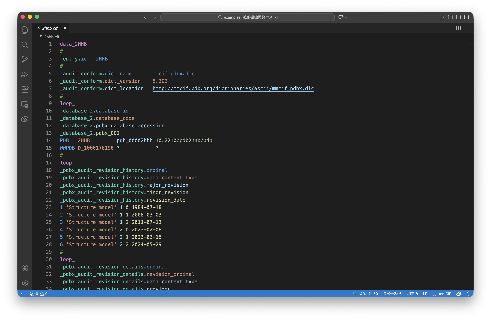
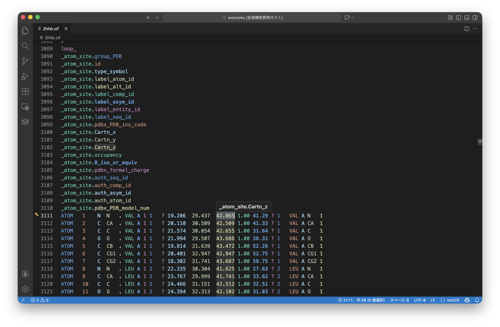

# mmCIF Rainbow Columns (VS Code Extension)

This extension provides enhanced syntax highlighting and visual aids for **mmCIF** (Macromolecular Crystallographic Information File) files, widely used in structural biology.

It is designed to make reading and editing complex `loop_` blocks easier. Unlike existing CIF editors or syntax highlighters, this extension focuses on human-readable visualization of mmCIF loop columns, inspired by [Rainbow CSV](https://github.com/mechatroner/vscode_rainbow_csv).


## Features

### 🌈 Rainbow Column Highlighting
Columns in `loop_` blocks are automatically colored to visually distinguish them.
- Each column (field name and its corresponding values) gets a unique color from a cycling rainbow palette.
- Helps quickly align keys with their values in large tables.



### 🔦 Cursor Column Highlighting
When you place your cursor on a field name or a data value:
- The **entire column** is highlighted (including the header and all data rows).
- This makes it easy to track which column a value belongs to or find all values for a specific field.
- Supports standard values and multi-line (`;...;`) strings.

### ℹ️ Enhanced Dictionary Hover
Hover over any data value, attribute name, or category to see its **official definition**.
- **Context-Aware**: Shows descriptions for Categories (e.g., `_atom_site`) and Items (e.g., `id`).
- **Dictionary Data**: Fetches descriptions directly from the `mmcif_pdbx_v50` dictionary.
- **Online Links**: Provides direct links to the wwPDB online documentation for further reading.



## Installation

1. Install via the VS Code Marketplace (search for "mmCIF Rainbow").
2. Open any `.cif` or `.mmcif` file. Highlighting and hover features will activate automatically.
3. Or build from source:
   ```bash
   npm install
   npm run compile
   ```

## Configuration

The extension uses Semantic Highlighting. You can customize the colors by adding the following to your VS Code `settings.json`:

```json
"editor.semanticTokenColorCustomizations": {
    "rules": {
        "rainbow1": "#ff0000",
        "rainbow2": "#ff7f00",
        // ... up to rainbow10
    }
}
```

## Limitations

- **File Size Limit**: Due to VS Code's internal API limitations, extensions cannot access the content of files larger than approximately **50MB**. Therefore, rainbow coloring and hover features will not be available for these massive files. This is a platform restriction that cannot be bypassed by standard extensions.

## Future Roadmap

- [ ] **Massive File Viewer**: We are considering developing a dedicated Custom Document Viewer to handle massive mmCIF files (>50MB) that exceed VS Code's standard text editor limits.

## Contributing

Issues and Pull Requests are welcome!


